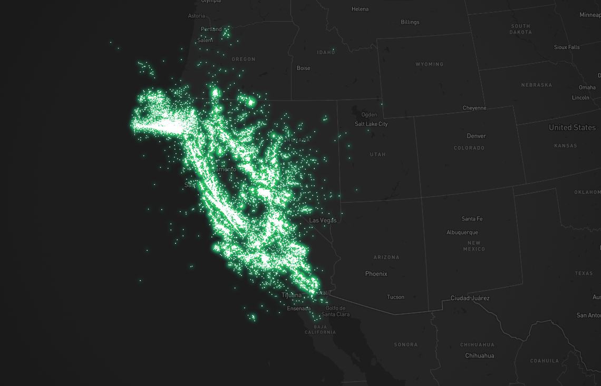

# mapbox-glowworm-example
适用于mapbox-gl的萤火虫打点效果

效果如下：



1. 在App.vue中配置自己的mapbox token
```typescript
const initMap = () => {
  mapboxgl.accessToken = '';
  map.value = new mapboxgl.Map({
    ...
  });
  map.value!.on('load', () => {
    addLayer();
  })
}
```
2. yarn
3. yarn dev
